# Research notes

Working notes for the Braille OCR project: what we're building, how the current
pipeline works, what data we train and evaluate on, and the prior work we're
building on. This is a lab notebook, not documentation — see `README.md` for
how to actually run things.

## Problem

Read embossed Braille from ordinary **phone photos** — pages, signage, elevator
buttons — and back-translate to text. This is harder than the scanned-page
setting most published work targets: uncontrolled lighting, perspective, the
Braille occupying a small and variable fraction of the frame, and (for pages)
verso dots showing through.

## Process we've developed

The pipeline (`pipeline.py`) is detect → classify → back-translate, with a
substantial amount of recovery machinery around the detector because a missed
cell is a wrong word, not just a wrong character.

1. **Container detection** (`container_detect.py`). Classical CV — edges,
   contours, filtered to rectangular (page/sign) or circular (button) shapes.
   No model. Cropping to the container before detection raises the *effective*
   resolution of the dots after YOLO's mandatory resize, which plausibly
   matters more than the detector architecture when the Braille is a small part
   of the frame. Whether a candidate actually contains Braille is decided by a
   quick detection pass per candidate, since shape alone can't tell you.

2. **Scale normalisation + tiling** (`dot_pattern_utils.py`, shared by
   `pipeline.py` and `prepare_yolo_dataset.py`). YOLO resizes its input to a
   fixed size, so "pixels per cell" depends on shooting distance. We pick a
   native tile size such that cells land at `TARGET_CELL_PX` after the standard
   resize, and tile the original image at that native size. **Training uses the
   same tiling**, so the detector never sees a scale range at test time it
   didn't see in training. These constants are shared in one module precisely
   so the two sides can't drift apart.

3. **Cell detection**. Two detector options, and they differ in kind:
   - *Third-party*: HF `snoop2head/yolov8m-braille`, 64 classes where the class
     name is the 6-bit dot pattern string — detection and classification in one
     model. This is `pipeline.py`'s default.
   - *Ours*: `cell_detector.pt`, YOLOv8n, **single class, localization only**
     (~3M params), with dot patterns left to the MobileNetV2 classifier in
     stage 6. mAP50 0.995 / mAP50-95 0.864 on held-out val. Splitting the jobs
     is what lets `braille_natural` (localization-only labels) contribute to
     detector training, and it keeps the detector small enough to export to the
     browser. Per the `dataset` repo's notes, tiling took real-world detection
     quality from unusable to comparable with the 26M-param third-party model.

   `prepare_yolo_dataset.py` can build either a 64-class or a `--single-class`
   training set. `fliplr` augmentation is forced off in `train_detector.py` — a
   horizontally flipped cell is a *different valid* pattern (dot1↔dot4), so the
   default augmentation would teach wrong appearance→class associations.

4. **Grid-guided rescue**. Detect at a low threshold (`LOW_CONF = 0.05`), treat
   `conf ≥ HIGH_CONF = 0.30` cells as reliable, fit a per-row grid to those, and
   for each expected grid position with no reliable detection promote the best
   nearby low-confidence candidate. Further recovery stages: single-cell crop
   re-detection at very low threshold, pixel-level dot detection with a
   calibrated threshold for gaps, and indicator-gap recovery.

5. **Contrast search**. Multiple contrast/CLAHE settings are tried and the best
   scoring pass kept (`--no-contrast-search` to skip).

6. **Cell reclassification** (optional). MobileNetV2 on 64×64 crops
   (`train_classifier.py`), head = `Linear(1280, 6)` with **six independent
   sigmoid dot outputs** and BCE loss, rather than 64-way softmax — dots are
   independent physical features, and this shares evidence across patterns.

7. **Space inference and line grouping**, then **back-translation** via liblouis
   `lou_translate` (default table `en-ueb-g2.ctb`), then spell-check cleanup.

8. **Browser path**. `export_onnx.py` exports detector + classifier to ONNX for
   an onnxruntime-web implementation in `js/` (tiling, NMS, line layout ported
   to JS with tests). `OCR_SETUP.md` documents an older/alternative TF.js route
   and is partly stale relative to the ONNX path.

**Evaluation** (`evaluate.py`): detection recall, detection precision, class
accuracy over matched cells, and F1, matching a predicted cell to ground truth
by nearest centre within `0.5 × avg GT cell width`. Note this is cell-level; we
do not yet report a text-level metric (CER/WER after back-translation), which is
what actually matters to a user.

### Pipeline flow

Stages marked **[B]** are covered by `bench.py`. Detector forward passes are
marked ⚙ — note how many stages trigger them, which is why detection dominates
the profile.

```mermaid
flowchart TD
    A["Photo (JPEG, ~12MP)"] --> B["Decode + EXIF orient<br/>PIL"]
    B --> C["find_containers<br/>edges → contours → rect/circle filter<br/><i>classical CV, no model</i>"]
    C --> D{"Container<br/>candidates?"}
    D -->|none| E["Treat whole image<br/>as one container"]
    D -->|1..n| F["Per-container crop"]
    E --> G
    F --> G["best_contrast ⚙<br/><i>tries contrast/CLAHE levels,<br/>keeps most high-conf cells</i>"]

    G --> H["Pass 1: run_detection_tiled ⚙<br/>tiles at TILE_SIZE=640"]
    H --> I["Measure median cell width<br/>solve L = medianW x 640 / 30"]
    I --> J{"L/640 outside<br/>0.67..1.5?"}
    J -->|yes| K["Pass 2: run_detection_tiled ⚙<br/>re-tile at native size L"]
    J -->|no| L
    K --> L["Candidate cells<br/><i>conf >= 0.05</i>"]

    L --> M["grid_fill<br/><i>fit per-row grid from conf>=0.30 cells,<br/>promote low-conf at expected positions,<br/>extrapolate past line ends</i>"]
    M --> N["crop_recover ⚙<br/><i>per-position crop, all contrast levels,<br/>conf >= 0.001</i>"]
    N --> O["gap_pixel_recover ⚙<br/><i>pixel brightness dot test,<br/>separates missed cells from word spaces</i>"]
    O --> P["Margin filter<br/><i>drop cells outside the text block</i>"]
    P --> Q["indicator_recovery ⚙<br/><i>UEB indicator with oversized gap<br/>→ partner cell probably missed</i>"]

    Q --> R["reclassify_cells<br/>MobileNetV2, 6 sigmoid dot outputs<br/><i>batched, overrides detector's bits</i>"]
    R --> S["group_into_lines<br/><i>chain cells within 0.55 x median height</i>"]
    S --> T["insert_spaces<br/><i>gap > line median + threshold → space</i>"]
    T --> U["Unicode Braille<br/>U+2800 block"]
    U --> V["braille_to_text<br/><i>liblouis lou_translate subprocess,<br/>en-ueb-g2.ctb</i>"]
    V --> W["clean_translation<br/><i>spell-fix lowercase words >=6 chars,<br/>strip orphan UEB indicators</i>"]
    W --> X["English text"]

    Q -.-> Y["save_annotated / save_dot_grid<br/><i>debug JPEGs</i>"]

    classDef benched fill:#2d6a4f,stroke:#95d5b2,color:#fff
    classDef unbenched fill:#6a4c2d,stroke:#d5b292,color:#fff
    class B,C,H,K,R benched
    class G,M,N,O,P,Q,S,T,V,W,Y unbenched
```



Green = measured by `bench.py` today. Brown = not measured. Every stage marked
⚙ runs the detector again, so the true cost of a "recovery" stage is mostly
detector time attributed to it, not to detection.

### Measured cost

`bench.py` wraps the real pipeline functions in place and runs the real
`process_container()`, timing every stage exclusively (a stage's time excludes
any wrapped stage it calls) and counting detector forward passes at the model
object. Raw results land in `bench/results/<date>-<dataset>.json`.

Sample-images run, 3 images x 2 repeats, contrast search off, MPS on a laptop
(`bench/results/2026-09-22-samples.json`):

| stage | ms/image | share | detector passes/image |
|---|---:|---:|---:|
| `crop_recover` | 18729 | 62.7% | 373.3 |
| `gap_pixel_recover` | 4472 | 15.0% | 1.7 |
| `run_detection` (tiled) | 3414 | 11.4% | 48.0 |
| `clean_translation` | 1646 | 5.5% | 0 |
| `reclassify_cells` | 820 | 2.7% | 0 |
| `braille_to_text` (liblouis) | 369 | 1.2% | 0 |
| everything else | ~430 | ~1.4% | 0 |
| **TOTAL** | **29877** | | **423** |

What this changes:

- **Detection is not the bottleneck; recovery is.** The tiled detection we spend
  all our design attention on is 11% of runtime. The recovery stack is ~78%.
- **Nearly all runtime is detector forward passes** — but only 48 of ~423 are
  tile passes. `crop_recover` issues the rest, one per position per contrast
  level, each a separate single-image call.
- **The recovery stack is expensive in proportion to how much the first pass
  missed**, so its cost is input-dependent in a way detection isn't.
- **`clean_translation` costs more than the classifier and liblouis combined**,
  for pure-CPU spell-checking.

**Do not trust these to two significant figures.** Across three runs of
differing size, total went 33.2s → 46.2s → 29.9s per image and `crop_recover`'s
forward passes went 630 → 373, because both depend on how many cells the first
pass missed on the particular images sampled. The *ordering* is stable and the
forward-pass counts are counts rather than timings, but the magnitudes need
experiment #4 in the efficiency backlog (bootstrap CIs) before they mean
anything precise.

Earlier, a version of `bench.py` that measured only 5 of the 16 stages reported
5.2s/image and attributed 80% to detection. Both numbers were artifacts of
what was instrumented — worth remembering before quoting any profile.

### Open questions / things to revisit

- **Confidence is destroyed inside the pipeline** — the biggest problem we
  know about. See "Future work" below.
- No end-to-end text-level accuracy metric yet.
- `TARGET_CELL_PX` was chosen by design reasoning, not fit empirically.
- We generalised poorly to real phone photos despite good held-out mAP on
  page-scan datasets — which is why `braille_natural` was added.
- Contracted (Grade 2) output correctness depends entirely on liblouis; no
  language-model correction beyond spell-check.

## Datasets

Source repos are expected as siblings of this repo (`REPOS_ROOT`); the pinned
`dataset` repo version is in `dataset.version`.

| Dataset | Loader | Content | Labels | Used for |
|---|---|---|---|---|
| **Angelina** | `angelina_data.py` | Single-sided labeled pages: `handwritten/` (all→train), `uploaded/test2/` (70/15/15), `books/` (author's own train/val split, respected as-is since adjacent book pages are near-duplicates) | Per-cell bbox + 6-bit pattern, CSV, fractional coords | Detector (64-class or single-class) + classifier crops |
| **DSBI** | `dsbi_data.py` | Double-sided Braille images, recto/verso pairs, pre-deskewed | Per-cell row/col + dot1–6, with grid line positions | Detector (64-class or single-class) |
| **braille_natural** | `braille_natural_data.py` | Real-world natural-scene photos (signage, elevator buttons); 164 train + 48 test, distributed in three annotation formats (VOC/Org/ICDAR) that are the same images | **Localization only** — single generic class, no dot patterns | Single-class detector only (`--single-class`) |

`prepare_yolo_dataset.py` combines these into one tiled YOLO dataset, tagging
filenames by source so the datasets' generic page-numbered filenames can't
collide. `extract_crops.py` builds the classifier crop set from Angelina.

### Candidate datasets we don't have

- **NSBD** (Natural Scene Braille Dataset, Lu et al. 2022) — natural-scene
  Braille images, built precisely because prior Braille detection work targeted
  scanned documents only. Closest match to our phone-photo setting of anything
  found.
- **The improved-YOLOv11 natural-scene dataset** (2025) — the paper states a
  publicly available Braille detection dataset accompanies it. Worth checking
  whether it overlaps NSBD or `braille_natural`.
- **Line-level Amharic Braille** (Sci Rep 2024) — new embossed-page images with
  line-level transcriptions rather than per-cell boxes. Labels are Amharic so
  they can't feed a 64-class detector as text, but the cells are still 6-dot, so
  it could serve as a second localization-only source alongside `braille_natural`.
- **Fly-LeNet multilingual set** (2024) — unverified whether it releases images
  or reuses existing public collections.
- **BrailleBench** (2026) — not images at all: 5,570 aligned English/Grade 1/
  Grade 2 Braille instances. Relevant as a *text-stage* test set for our
  back-translation output.

## Related work

Collected over three search rounds (Sept 2026). Details come from abstracts and
search-result summaries, not full reads, so treat specifics as provisional —
especially reported accuracy numbers. "Widely cited" / "recent" is noted per
paper.

### Cluster 1 — Datasets and benchmarks

- **DSBI: Double-Sided Braille Image Dataset and Algorithm Evaluation for
  Braille Dots Detection** (2018, arXiv / ACM). Releases the double-sided page
  dataset with recto dot, verso dot, and cell annotations, and evaluates dot
  detection on it. *Widely cited.* → We use it directly (`dsbi_data.py`); it
  defines the recto/verso show-through problem.
- **Anchor-Free Braille Character Detection Based on Edge Feature in Natural
  Scene Images** (2022, Computational Intelligence and Neuroscience). Builds
  **NSBD**, a natural-scene Braille image dataset, explicitly noting that all
  prior Braille detection work targeted scanned documents. *Moderately cited.*
  → The dataset is the single most directly relevant thing found; see also the
  method note in Cluster 2.
- **BrailleBench: Investigating Multi-Criteria Braille Comprehension in Large
  Language Models** (2026, arXiv 2608.27268). Aligns 5,570 instances across five
  datasets in English and Braille Grades 1 and 2, built by a deterministic,
  expert-reviewed pipeline with no LLM-generated data. *Very recent.* → Gives us
  a text-stage evaluation set and, crucially, a Grade 1 vs Grade 2 breakdown.
- **Brno Mobile OCR Dataset** (2019, arXiv). Text-page photographs taken with
  mobile phones under realistic capture conditions, for OCR benchmarking. *Well
  cited.* → Not Braille, but the closest analogue of our "phone photo, not scan"
  distribution shift, and a model for how to construct such a dataset.

### Cluster 2 — Detection and localization

- **Optical Braille Recognition Using Object Detection Neural Network** (2021,
  ICCVW / ACVR). Detects each Braille cell as an object rather than finding dots
  then grouping them. *Widely cited; the common modern baseline.* → The Angelina
  dataset's own paper, and the approach our detector follows.
- **Optical Braille Recognition Based on Semantic Segmentation Network with
  Auxiliary Learning Strategy** (2020, CVPRW). Segmentation-based dot
  localization over whole pages with auxiliary supervision. *Widely cited.* →
  The main alternative to per-cell detection, and a principled version of what
  our hand-rolled pixel-level dot recovery stage is doing.
- **Anchor-Free Braille Character Detection Based on Edge Feature in Natural
  Scene Images** (2022, CIN). *Method side:* argues Braille characters in
  natural scenes are small and defined by dot edges, and uses an anchor-free
  detector suited to small objects. *Moderately cited.* → Same diagnosis as ours
  (effective resolution, not architecture, is the bottleneck) with a different
  remedy: architecture instead of tiling.
- **Real-Time Braille Image Detection Algorithm Based on Improved YOLOv11 in
  Natural Scenes** (2025, Applied Sciences). Gated Bottleneck Convolutions in a
  reworked C3k2 block, ULSAM subspace attention, and an SDIoU regression loss,
  targeting weak dot-matrix features under background clutter while staying
  real-time. *Recent.* → Our exact setting and our exact three-way tradeoff
  (small-target features, real-time cost, cross-scene generalization); ships a
  public dataset.
- **SAHI: Slicing Aided Hyper Inference** (2022, ICIP). Slices high-resolution
  images into overlapping patches, detects per patch, merges predictions;
  reported +5–7 AP for small objects, detector-agnostic. *Widely cited.* → The
  general form of our tiling scheme. Worth comparing our
  `detectScaleNormalized()` against it, particularly its full-image pass merged
  with slice predictions, which we do not do.
- **Adaptive Slicing-Assisted Hyper Inference** (2026, arXiv). Makes the slice
  size adaptive rather than fixed. *Very recent.* → Directly comparable to our
  median-cell-width-driven choice of native tile size; likely the closest prior
  art to that specific trick.

### Cluster 3 — Cell and dot-level classification

- **Deep Learning Strategy for Braille Character Recognition** (2021, IEEE
  Access). CNN classification of pre-segmented Braille characters. *Widely
  cited.* → Comparable to our MobileNetV2 stage, though we predict six
  independent dots rather than a 64-way class.
- **A Generalized Ensemble Approach Based on Transfer Learning for Braille
  Character Recognition** (2024, Information Processing & Management). Ensembles
  transfer-learned backbones to generalize across Braille character datasets.
  *Recent.* → Targets our failure mode: good held-out accuracy on one source,
  poor transfer to a different capture setup.
- **Dot Detection of Braille Images Using a Mixture of Beta Distributions**
  (classical, pre-deep-learning). Models a scanned Braille page as three
  gray-level classes — background, recto dots, verso dots — and separates them
  by stability thresholding, then fits a grid. *Older, moderately cited.* →
  Essentially a principled version of our `calibrate_dot_threshold()` /
  `pixel_cell_present()` stage, plus a verso-rejection story we currently lack.
- **A Deep Learning Approach for Line-Level Amharic Braille Image Recognition**
  (2024, Scientific Reports). End-to-end line-level sequence recognition instead
  of per-cell classification. *Recent.* → Suggests replacing our grid-fitting
  and space-inference stages with a sequence decoder that sidesteps per-cell
  segmentation errors and handles multi-cell contractions natively.
- **Fly-LeNet: A Deep Learning-Based Framework for Converting Multilingual
  Braille Images** (2024). Lightweight CNN for multilingual Braille image→text.
  *Recent.* → Reference point for the compute-cheap browser/ONNX path.

### Cluster 4 — The text stage: translation, contraction, and correction

- **Vision-Braille: A Curriculum Learning Toolkit and Braille–Chinese Corpus for
  Braille Translation** (2024, arXiv). Braille↔text corpus plus curriculum
  training, presented as an end-to-end Braille image-to-text tool for Chinese
  visually impaired students. *Recent.* → The learned counterpart to our
  deterministic liblouis back-translation.
- **BrailleLLM: Braille Instruction Tuning with Large Language Models for
  Braille Domain Tasks** (2025, arXiv 2510.18288). Instruction-tunes LLMs on
  Braille-domain tasks. *Recent.* → A candidate post-processor for our output,
  where contraction ambiguity is a language problem, not a pixel problem.
- **"I'm Sorry, but I Can't Help with Braille": Revealing Accessibility Failures
  in State-of-the-Art LLMs** (2026, arXiv 2607.11893). Documents where current
  LLMs fail on Braille input and output. *Very recent.* → A caution before we
  reach for an LLM as a correction stage; tells us which failure modes to expect.
- **Post-OCR Document Correction with Large Ensembles of Character
  Sequence-to-Sequence Models** (2021, arXiv; code released). Character-level
  seq2seq ensembles with diagonal attention loss, copy and coverage mechanisms.
  *Well cited.* → The standard non-LLM formulation of the stage our spell-check
  cleanup is a crude stand-in for.
- **Leveraging LLMs for Post-OCR Correction of Historical Newspapers** (2024,
  LT4HALA). Compares instruction-tuned Llama 2 against fine-tuned BART; reports
  a 54.5% CER reduction vs BART's 23.3%. *Recent.* → Evidence that a general LLM
  can beat a task-tuned seq2seq at post-OCR correction — but on English prose,
  not contracted Braille, which the accessibility-failures paper above suggests
  will not transfer for free.

### Cluster 5 — Deployment and evaluation in the assistive setting

- **Evaluating OCR Performance for Assistive Technology: Effects of Walking
  Speed, Camera Placement, and Camera Type** (2026, arXiv 2602.02223). Measures
  how capture conditions, not model quality, drive OCR performance for assistive
  use. *Very recent.* → The evaluation axis we have no data on at all: our
  metrics assume a photo already exists and is reasonable.
- **Braille Recognition using a Camera-enabled Smartphone** (2016). Early
  smartphone-camera Braille recognition. *Older.* → Historical anchor for the
  phone-photo framing; useful mainly to see which problems are genuinely new
  versus long-standing.

Still deliberately excluded (plausible but venue/peer-review status unverified):
YOLOv5 handwritten-Braille recognition, separable-CNN + contour segmentation
systems, "Dots to Dialogue" Braille image-to-speech, and the YOLOv8 real-time
Braille letter detection preprint.

## Where this leaves us

The collected work points at four open questions, in rough order of how much
they should change what we do. **First, our evaluation is measuring the wrong
thing**: we report cell-level detection and classification metrics, while
BrailleBench and the post-OCR correction literature both evaluate at the text
level, and BrailleBench's finding that Grade 2 is specifically fragile on the
*input* side maps exactly onto the part of our pipeline we have never measured —
liblouis back-translation of contracted output. **Second, our tiling scheme is
reinventing SAHI**, and possibly its adaptive variant; we should find out
whether the published versions beat ours, particularly SAHI's merge of a
full-image pass with slice predictions, before investing further in our own.
**Third, the natural-scene branch of this literature (NSBD, anchor-free edge
features, improved YOLOv11) has converged on the same diagnosis we reached
independently — effective resolution on small dot-matrix targets is the
bottleneck — but treats it architecturally rather than by tiling**, and nobody
seems to have compared the two remedies. **Fourth, everyone's post-OCR
correction is now an LLM, and nobody has shown it works for contracted Braille**;
the accessibility-failures paper suggests the naive version will not. Two papers
to read first: **Real-Time Braille Image Detection Based on Improved YOLOv11 in
Natural Scenes** (2025), because it is our exact setting, states our exact
tradeoffs, and ships a public dataset we can test the current detector against
this week; and **BrailleBench** (2026), because it hands us the text-level,
Grade-1-vs-Grade-2 evaluation frame whose absence is currently our biggest blind
spot.

## Novelty check (what we can actually claim)

Checked Sept 2026 against primary sources — paper text where reachable, released
implementations where not. Verification level noted per claim.

### Claim 1: scale normalization to a target object pixel density — **holds, narrowly**

What we do: enforce one target *object* density (`TARGET_CELL_PX = 30`) on both
sides of the model, and at inference measure median detected cell width, solve
`medianW × TILE_SIZE / L = TARGET_CELL_PX` for native tile size `L`, and re-tile.

What the prior art does:

- **SAHI** (`sahi/slicing.py`, read directly). `get_auto_slice_params()` picks
  slice size from **image resolution alone** — a `calc_resolution_factor()`
  bucketing into low/medium/high/ultra-high with preset overlap ratios,
  "independent of any annotation data". `slice_coco()`, which slices training
  sets, does **not** choose a size: the caller must pass `slice_height` /
  `slice_width` (default 512).
- **ASAHI** (2026, paper read). Also resolution-driven, and explicitly inverts
  the problem: "instead of prescribing a fixed patch size, we fix the number of
  patches and adaptively compute the corresponding dimensions based on image
  resolution." Threshold `T = r × (4 − 3μ) + 1` → 6 or 12 patches. Its
  Slicing-Assisted Fine-tuning combines full images with sliced patches, but
  again sizes them from resolution.

So: slicing is old, slicing the training set is old, and "adaptive" slicing
exists — but **both adapt to image resolution, and neither adapts to measured
object size**. Deriving the slice size from a first-pass measurement of the
objects, to land them at a fixed pixel density the detector was trained at, is
the part we have not found elsewhere. It's available to us because Braille cells
have a known uniform physical size, which general small-object detection cannot
assume.

*Verification caveat:* SAHI's paper PDF would not render as text and the README
is silent on fine-tuning, so the SF claim rests on the released implementation,
not the paper's prose. Read the SF section before publishing.

*Also worth noting:* SAHI and ASAHI both merge a **full-image pass** with the
sliced predictions. We do not. That is a gap in our method, not theirs.

### Claim 2: 6-way multi-label dot factorization — **weak; do not lead with it**

- **Ovodov / AngelinaReader** uses **64 discrete classes**. Verified from his own
  `braille_utils/label_tools.py`: conversions between `int_label` [0..63],
  `label010` 6-bit strings and `label123`, with `label_is_valid` exactly 64
  entries long — the 6 dot bits (`v = [1,2,4,8,16,32]`) are combined into a
  single 64-value classification space.
- The CNN-classifier line of work (Fly-LeNet, the multilingual DCNN papers)
  one-hot encodes the dot combination — again 64-way, not 6 binary heads.
- **But** dot-level prediction itself is the classical mainstream: DSBI detects
  recto/verso *dots*, and the CVPRW 2020 segmentation method localizes *dots*
  and groups them into cells. "Predict dots, not characters" is decades old.

So our actual position is a hybrid, not a new primitive: cell-level
*localization* with within-cell *multi-label dot* classification. The
defensible part is the consequence, not the factorization — because the detector
carries no dot semantics, sources with **localization-only labels**
(`braille_natural`, and potentially the Amharic line-level set) can train it,
which a 64-class detector structurally cannot use.

To claim anything here we need an ablation we have not run: same crops, same
backbone, 64-way softmax head vs 6-sigmoid head, measured on cell accuracy *and*
on rare patterns. Absent that, "6 independent sigmoids" is an implementation
choice, not a finding.

*Unverified:* the Amharic line-level paper's output representation (Nature was
behind an auth redirect). Assumed to be Amharic character classes via a sequence
decoder, not dot multi-label.

### What this means for how we frame the work

Lead with the scale contract and with **label heterogeneity as a data strategy** —
designing the system so datasets with incompatible label types all train the same
model. Treat the multi-label head as a design detail that enables it. Do not
claim cell-as-object detection, grid fitting, pixel-level dot thresholding, or
slicing as novel; all are established.

## Efficiency experiment backlog

Prioritized against the measured profile (see `bench.py` and
`bench/results/`), not against intuition. The headline constraint: **~85% of
runtime is detector forward passes, 678 per image at ~50ms**, but only 48 of
those are tiled detection — 630 come from `crop_recover`.

That gives two independent levers:

- **Lever A — fewer forward passes** (algorithmic). Currently untouched, and
  where the largest wins are.
- **Lever B — cheaper forward passes** (quantization, export, model size).
  Multiplies across *all* 678 passes, so it is not wasted effort — but a 2x
  cheaper pass on a call pattern that is 10x too chatty is the smaller win.

**Rule for every experiment below:** run `evaluate.py` alongside `bench.py` and
report both. An efficiency change that silently drops recall converts a speed
win into more fabricated text, which is the failure mode we least want (see
"Future work"). Speed-only results are not acceptable evidence here.

### Tier 1 — do these first (high payoff, low risk, days not weeks)

| # | Experiment | Hypothesis | Measure |
|---|---|---|---|
| 1 | **Yield audit of `crop_recover`** | On the sample run it issued ~630 forward passes to recover 7 cells (~90 passes/cell). Most extrapolated positions are past the true end of the line and will never yield anything. | Passes per *accepted* cell, per position type (`edge` vs `gap`), and the distribution of how far past the last real cell an accepted rescue occurs. This one experiment likely determines the whole optimization strategy. |
| 2 | **Batch the recovery forward passes** | `crop_recover` issues one single-image call per position per contrast level. Batching crops into one forward pass per batch should cut per-call overhead dramatically, as the classifier already does (1ms/cell batched). | ms/image and passes/s at batch sizes 1/8/32/64. Accuracy must be identical — same crops, same model, only grouping changes. |
| 3 | **Stop round-tripping tiles through disk** | Every call saves a temp JPEG and hands ultralytics a *path*, forcing an encode + reload. Measured at only ~2% for full tiles, but the fraction grows as crops shrink, and 630 small crops is a different regime from 48 large tiles. | ms/call for path vs in-memory array, at tile size and at crop size. |
| 4 | **Bootstrap confidence intervals over images** | Our n is 2-3 images. `crop_recover` cost depends on how many cells the first pass missed, which varies far more across images than detection does — so point estimates here are probably not separable. | Resample images with replacement, report 95% CI per stage. Cheap, and it tells us how many images a benchmark run actually needs to detect a given effect. Do this *before* trusting any result below. |

### Tier 2 — parameter sweeps (cheap to run, need the CIs from #4 to interpret)

| # | Experiment | Hypothesis | Measure |
|---|---|---|---|
| 5 | **Contrast-level pruning in `crop_recover`** | It tries every contrast level at every position. The marginal yield of the 3rd/4th level is probably near zero. | Cells recovered per contrast level. Drop levels below a yield threshold. |
| 6 | **Tile overlap sweep** (`DEFAULT_TILE_OVERLAP_FRAC`, currently 0.2) | Overlap exists so cells straddling a tile edge are caught by a neighbour. 0.2 on a 12MP image gives 48 tiles; 0.1 would give noticeably fewer. | Tiles/image, ms/image, and edge-cell recall — the thing overlap is buying. |
| 7 | **`TARGET_CELL_PX` sweep** (currently 30) | Chosen by design reasoning, never fit. Lower target → larger tiles → fewer of them, quadratically. If 24px is as accurate as 30px, that is a ~35% tile-count reduction for free. | Cell accuracy and detection recall vs tiles/image across 20/24/30/36/44. **Requires retraining per value** — the contract binds training and inference, so this is the most expensive sweep here, and the most likely to change the architecture's cost profile. |
| 8 | **Spell-check cost** | `clean_translation` is 10.7% of runtime (~4.9s) for pure-CPU Python, more than the classifier and liblouis combined. Almost certainly per-word dictionary construction or lack of caching. | ms/word, with and without caching; profile it before optimizing. Note we may want to *delete* this stage on accuracy grounds anyway (see "Future work") — check that before investing. |

### Tier 3 — per-pass cost (your original suggestions; real, but after Tier 1)

| # | Experiment | Hypothesis | Measure |
|---|---|---|---|
| 9 | **Post-training int8 weight quantization** | Standard, well-supported, ~2-4x on CPU and a 4x model-size drop that matters for the browser path. Applies to all 678 passes. | ms/pass, model size, and — critically — per-dot accuracy. Braille dots are *low-contrast* features; quantization error may hurt this task more than it hurts typical object detection. That hypothesis is worth testing explicitly rather than assuming the standard result transfers. |
| 10 | **fp16 / ONNX Runtime / CoreML export** | Often a larger and safer win than int8, and the ONNX path already exists (`export_onnx.py`). | ms/pass per backend, numerical parity against the `.pt` model (the export notes already record 5.7e-6 max logit diff for the classifier — do the same for the detector). |
| 11 | **Activation quantization** | Only if #9 is insufficient. Needs a calibration set and is far more invasive; activation ranges vary with lighting, which is exactly our most variable input property. | Same as #9, plus sensitivity to the calibration set's lighting distribution. I would expect this to be where Braille's white-on-white signal breaks down first. |
| 12 | **Model capacity sweep** (yolov8n vs s vs m) | Our 3M model matches a 26M one *because* the scale contract removed the variety that capacity buys. The corollary is that something even smaller might also suffice. | Accuracy/latency frontier at fixed `TARGET_CELL_PX`. A win here compounds with everything in Tier 3. |

### Two framing points

**"Context" and "layers" don't transfer.** Context length is an LLM concept —
there is no sequence here, so there is nothing to sweep. "Impact of layers" is
real but is the capacity question (#12): you would change the backbone, not
prune layers individually.

**The efficiency and honesty agendas point the same way.** The stage costing
70% of runtime is also the stage that fabricates the most aggressively
(`CROP_CONF = 0.001`). If the Tier 1 yield audit shows most of those 630 passes
recover nothing, then cutting them makes the system *both* faster and less prone
to inventing text. That is the rare case where the performance work and the
accessibility work are the same work — and it argues for running experiment #1
before anything else.

### Experiment 1 result: `crop_recover` is not worth optimizing

`experiments/crop_recover_yield.py`, 3 sample images
(`bench/results/2026-09-22-crop-yield.json`):

```
positions attempted   224
forward passes       1120
cells accepted          14   (6.2% of positions)
passes per accepted     80
wall clock           62.8s   (4.5s per accepted cell)

confidence of accepted cells:
  min 0.0010   median 0.0014   max 0.0063
  below HIGH_CONF (0.3): 14/14 (100%)
```

**Every single cell this stage recovers is at a confidence indistinguishable
from noise.** The maximum confidence across all 14 accepted cells is 0.0063 —
two orders of magnitude below the 0.3 we call "reliable", and barely above the
0.001 acceptance floor. The stage is not rescuing faint-but-real cells; it is
returning the model's least-bad guess at positions where the model sees
nothing, and those guesses then flow into the text as ordinary characters.

So the stage costs ~63% of runtime, ~4.5 seconds per cell produced, and
everything it produces is a fabrication. That reframes experiments 2 and 3:
making this faster optimizes a stage whose output we may not want at all.

Supporting detail:

- **No usable cutoff by extrapolation step.** Acceptances are scattered
  (step 1: 3/44, step 3: 2/15, step 16: 1/4, step 18: 1/4) with no decay. The
  hypothesis that distant positions never yield anything is *not* supported —
  but given every acceptance is noise-level, the scatter is more likely
  measuring how often the model hallucinates on blank paper than how often a
  real cell hides far out.
- **Contrast 3.0 wins 8 of 14.** `crop_recover`'s own docstring notes that
  "contrast x3.0 on empty paper reliably scores above 0.05" — the reason
  multi-contrast search is restricted to edge positions. The audit suggests
  that reasoning applies to edge positions too: the level most likely to
  hallucinate on blank paper is the level winning most often.

**Next step is an ablation, not an optimization**: run `evaluate.py` with and
without `crop_recover` and compare end-to-end output. If accuracy is unchanged
or improves, deleting the stage removes ~63% of runtime and a fabrication
source in one move — the best available outcome, and one that no amount of
batching or quantization could match.

### Experiments 2 and 3 result: no win available inside `crop_recover`

`experiments/crop_call_modes.py`, 64 realistic crops (520x546), MPS laptop:

```
mode             total    ms/crop   speedup    boxes
path             4.51s      70.4     1.00x     1264
array            4.45s      69.6     1.01x     1280
batch-4          4.27s      66.8     1.05x     1280
batch-8          5.45s      85.1     0.83x     1280
batch-16        10.33s     161.3     0.44x     1280
batch-32         8.87s     138.6     0.51x     1280
batch-64         7.62s     119.1     0.59x     1280
```

- **Batching is slower, not faster** — 2.3x slower at batch-16. The classifier's
  1ms/cell comes from batching *64x64* crops; these are 520x546 and each
  already fills the model's input, so batching adds memory pressure with no
  parallelism left to exploit. Hypothesis refuted.
- **The disk round trip is ~1%** at crop size (it was ~2% at tile size).
  Not a speed win.
- **But transport changes results**: the temp-JPEG path finds 1264 boxes where
  the array path finds 1280 — JPEG quantisation at quality=95 is destroying
  ~1.25% of detections. Worth fixing on fidelity grounds, not performance
  grounds.

### Experiment 4 result: most of this profile is not yet measurable

`bench.py --bootstrap 2000`, 6 images, resampling **images** (not repeats —
repeats measure machine noise on one input; the uncertainty that matters is
across inputs). `bench/results/2026-09-22-bootstrap.json`:

| stage | mean ms | 95% CI | CI width |
|---|---:|---:|---:|
| total | 27682 | [21745, 35475] | 50% |
| `crop_recover` | 14015 | [8037, 21704] | **98%** |
| `gap_pixel_recover` | 5016 | [4566, 5444] | 18% |
| `clean_translation` | 3501 | [1497, 5459] | **113%** |
| `run_detection` | 3456 | [3319, 3586] | **8%** |
| `reclassify_cells` | 834 | [708, 957] | 30% |

Read the CI width column:

- **`run_detection` is solid at 8%.** Tiled detection costs what we think it
  costs — its work is set by image area, which barely varies across a sample of
  page photos.
- **`crop_recover` at 98% is barely an estimate.** Its true mean could plausibly
  be half or double what any single run reports, because its cost is set by how
  many cells the first pass missed — an input property, not an image-size
  property. This is why the same stage read 630 then 373 then 334 forward
  passes across runs.
- **`clean_translation` at 113% is worse than useless as a point estimate.** It
  scales with how many unrecognised words the spell checker has to correct,
  which varies with the text on the page.

Consequences for method:

1. **Never quote a stage cost from a single run** for anything except
   `run_detection`. The ordering (recovery >> detection) is stable and safe to
   act on; the magnitudes are not.
2. **Six images is not enough.** To detect, say, a 20% improvement in
   `crop_recover` we would need the CI width well under 20%; at 98% with n=6,
   and assuming width shrinks ~1/sqrt(n), that implies **n on the order of 150
   images**. Any A/B of a recovery-stage change on a handful of images will
   produce a number that means nothing.
3. **Prefer counts to timings for input-dependent stages.** Forward-pass counts
   and acceptance rates (experiment 1) are exact per run; wall-clock is not.

### Experiment 5 result (re-scored): no edge-cell deficit, and recovery adds no real cells

`experiments/edge_cell_recall.py`, **4 physical** held-out DSBI test pages,
2540 ground-truth cells (`bench/results/2026-09-22-edge-recall-union.json`).

> **Scoring correction, 2026-09-22.** The first version of this experiment
> scored 8 "pages" that were really 4 scans counted twice: DSBI's
> `<page>+recto.jpg` and `<page>+verso.jpg` are byte-identical (verified by md5
> for FM+1..FM+4), and each side's `.txt` labels only that side's cells. Cells
> the detector found from the other side were therefore scored as not matching
> ground truth. Caught by a parallel session, verified here. The script now
> groups by physical page and matches against the union of both sides' labels.
> **The conclusions below are unchanged by the fix** — only the denominators
> moved (230 added cells over 4 pages, not 460 over 8).

```
interior recall (detection)   2229/2232  (99.9%)
EDGE recall (detection)        304/308   (98.7%)
EDGE recall (after grid_fill)  298/308   (96.8%)

crop_recover      added 230 cells, 0 matched a real cell   (0.0%)
gap_pixel_recover added  29 cells, 0 matched a real cell   (0.0%)
```

Per page, showing the pattern is not driven by one outlier:

| page | gt cells | edge recall | crop_recover added | of those real |
|---|---:|---:|---:|---:|
| FM+1 | 450 | 58/58 | 70 | 0 |
| FM+2 | 450 | 58/58 | 53 | 0 |
| FM+3 | 820 | 94/96 | 57 | 0 |
| FM+4 | 820 | 94/96 | 50 | 0 |

1. **There is no edge-cell deficit on this data.** Detection finds 98.7% of
   line-end cells against 99.9% in line interiors — two pages are perfect at the
   edges, and the entire shortfall is 4 cells out of 308.
2. **Recovery adds no real cells.** 230 from `crop_recover` and 29 from
   `gap_pixel_recover`, none matching ground truth *even against the union of
   both sides' labels*, which is the most generous possible target — it counts a
   cell as real if it belongs to either face of the page.
3. **`grid_fill` loses 6 real edge cells** on FM+4 (94 -> 88), and none on the
   other three pages. A stage removing correct output, on one page in four.

**Internal control:** the same matcher pairs 2533 of 2540 ground-truth cells
with detections, so 0/230 is not a matching failure.

**Scope caveat.** DSBI is flat, evenly-lit page scans where detection is
near-perfect. The recovery stack was built for hard *phone photos*, and this
experiment does not test that regime — no labeled phone-photo set exists
(`braille_natural` is localization-only), which is why
`experiments/label_tool.py` was written. What carries over regardless of ground
truth is experiment 1's confidence finding on phone photos: every acceptance at
<= 0.0063, median 0.0014.

### Experiment 6 result: removing `crop_recover` improves the text and is 58% faster

`experiments/ablate_crop_recover.py`, 4 physical held-out DSBI test pages,
reference text built from the union of both sides' ground-truth cells through
the pipeline's own layout + liblouis path
(`bench/results/2026-09-22-ablation-union.json`):

```
mean CER with crop_recover     0.5861
mean CER without crop_recover  0.4961
delta                          -0.0900   → removal IMPROVES text
pages with identical text      0/4
wall clock  158.4s → 66.3s               (58% faster without)
```

Removing the stage makes the output text **better**, on every page, while
cutting runtime by more than half. That is the end-to-end confirmation the
intermediate counts pointed at: 230 fabricated cells do not merely waste time,
they corrupt the transcription.

The 58% speedup lines up with the ~63% profile share (experiment 4), and unlike
the CER figures it is not affected by any scoring question.

**Absolute CER is high (0.50-0.59) and is not a product quality figure.** Two
reasons, both about the reference rather than the pipeline: (a) the reference
interleaves recto and verso cells, because the detector reads both sides and
nothing separates them (see "Limitation: the pipeline cannot separate front from
back"), so even a perfect reader would score badly against it; (b) the reference
is machine-built from ground-truth cells, not a human transcription. The
with/without **delta** is what this ablation measures, and both sides share
those handicaps identically.

*Earlier invalid run:* a first pass scored 8 side-files against one side's
labels each and reported CER 2.1155 vs 1.7853. Those absolute numbers are
meaningless (the pipeline read both sides while the reference held one), though
the direction and the 64% speedup matched. Superseded by the above.

### `crop_recover` removed (2026-09-28)

Acted on experiments 1, 5 and 6. Removed from `pipeline.py`, and from
`evaluate.py`'s `run_pipeline()`.

`indicator_recovery()` went with it. That stage existed only to call
`crop_recover()` at targeted positions (a UEB indicator whose partner cell is
missing), so it could not survive independently. Its removal is by association,
not by direct measurement — we never measured its precision separately, and the
problem it addressed is real. If it comes back it needs a different mechanism;
`clean_translation()` still strips the orphaned `\NNN/` indicator tokens it was
meant to prevent.

`CROP_CONF = 0.001` stays: `gap_pixel_recover` still uses it, and `grid_fill`
stores it in the empties tuple.

**Regression check** (`experiments/text_cer.py`, 4 physical DSBI test pages,
`bench/results/2026-09-28-text-cer-after-removal.json`):

```
mean CER      0.4961      (ablation predicted 0.4961 for the without arm)
per page      0.416, 0.307, 0.598, 0.663
wall clock    18.0s per page   (36.1s per page with the stage)
```

Exact agreement with the predicted arm, and runtime halved.

The ablation harness became `experiments/text_cer.py` — there is nothing left to
ablate, but it is now the end-to-end regression test the repo lacked, and the
only text-level metric we have. `experiments/crop_recover_yield.py` was deleted
with the stage it audited; its results are recorded in "Experiment 1".

### Phone-photo spot check (IMG_3153)

First use of `experiments/label_tool.py`, on a 12MP phone photo of a Braille
page. 662 cells predicted at conf >= 0.3; the labeler (a human expert, checking
visually with zoom) found **no errors** — no wrong dot patterns, no false cells,
and no missing cells to add.

This is the first direct evidence about the *phone-photo* regime, and it cuts
against the last remaining defense of the recovery stack. The argument for
keeping `crop_recover` was that DSBI scans are easy and phone photos are where
faint line-end cells hide. On this photo the core path (scale-normalized tiled
detection + classifier, conf >= 0.3) was perfect, so every cell `crop_recover`
added here was added to a page that had nothing missing — consistent with
experiment 1's finding that all its acceptances on these images land at
<= 0.0063 confidence.

Caveats: n=1, a flat page rather than signage or a curved surface, and a
"no errors" verdict relies on the labeler noticing *absences*, which is harder
than noticing wrong cells (this is the confirmation-by-silence bias documented
in `label_tool.py`). It does not establish that phone photos are easy in
general; it does establish that this one was, and that our hardest-case
assumption should be tested rather than assumed.

Labeling-cost implication: on a page with no errors, correction-based labeling
costs one pass of visual inspection and produces 662 confirmed cells. That is
the economics the tool was built for, and it suggests the ~150-page target from
experiment 4 is reachable.

### Dataset contamination: `braille_natural` contains diagrams, not photographs

Found by the labeler on `img_116` while using `experiments/label_tool.py`: the
image is a printed reference **table** of Chinese Braille punctuation — hollow
circles for unraised dots, filled circles for raised, on white background with
Chinese column headers. It is not a photograph of Braille at all, and it carries
human-drawn cell boxes like every other page in the set.

Why this matters more than one bad image: our entire signal model is that
Braille is *geometry*, read from shadows (see "Problem"). A diagram of printed
circles is the opposite — pigment, not relief, with no lighting dependence and
no verso show-through. Training a detector to fire on both teaches two
incompatible appearance models under one label. `img_116` sits in
`natural_train`, so it is in the data our `cell_detector.pt` was trained on.

A crude scan (mean colour saturation < 0.06, pure-white fraction > 0.35) flags
**16 of 212** images as diagram-like, including `img_10`, `img_82`, `img_116`,
`img_133`, `img_134`, `img_143`, `img_149`. That is a heuristic and not a
verdict — some may be legitimate photographs of white paper under even light.

Action taken: `label_tool.py` now has a **"Not embossed Braille"** control that
records `out_of_scope: true` in the corrections file, so the exclusion list
comes from human judgement rather than pixel statistics. Once enough pages are
reviewed, `prepare_yolo_dataset.py` should skip flagged images.

Open question this raises about our own results: `braille_natural` is the source
we added specifically to fix poor generalization to real photos, and it is
partly not real photos. Any conclusion we have drawn about natural-scene
performance inherits that contamination.

### Limitation: the pipeline cannot separate front from back

Surfaced while re-scoring experiment 5. On a double-sided page the detector
finds verso (back-side) cells as readily as recto ones, and nothing downstream
separates them, so the output text interleaves both sides. This is invisible in
our cell-level metrics — a verso cell is a real cell, correctly located and
correctly classified — and it only shows up at the text level, which is another
argument for the text-level metric the "Future work" section calls for.

The classical literature has the mechanism we lack. Under top lighting a recto
dot (bulging toward the camera) shows light-above-dark, while a verso dot
(pressed away) shows dark-above-light — the shadow's *side* distinguishes them.
The Beta-mixture paper (Cluster 3) models a scanned page as three gray-level
classes — background, recto dot, verso dot — and separates them by stability
thresholding. DSBI's annotations carry per-side labels precisely because this
distinction is the dataset's reason for existing, and we currently discard it:
`dsbi_data.py` loads recto and verso sides as independent training images rather
than as two labelings of one physical page.

Two consequences worth acting on:

1. **Training may be mislabeled.** If the detector sees the same scan twice,
   once labeled with recto cells and once with verso cells, then each copy
   teaches it that the other side's cells are background. That is a plausible
   source of confusion, and it is checkable in `prepare_yolo_dataset.py`.
2. **We have no verso handling at all**, so any double-sided page produces
   interleaved text regardless of recognition quality.

## Future work

### 1. Preserve and surface confidence (highest priority)

Every stage after detection *manufactures* content, and each one launders
uncertainty into text that reads as exactly as trustworthy as text that was
genuinely recognised:

| Stage | What it invents | Threshold |
|---|---|---|
| `grid_fill()` | Promotes low-confidence candidates into real cells; extrapolates positions beyond a line's first/last detected cell | `LOW_CONF = 0.05` |
| `crop_recover()` / `gap_pixel_recover()` | Re-detects in a cropped region, accepting near-anything | `CROP_CONF = 0.001` |
| liblouis Grade 2 | Resolves context-dependent contractions | no notion of doubt |
| `clean_translation()` | Rewrites lowercase words ≥6 chars that the spell checker doesn't know into a *different real word* | — |

By the time text reaches the user, a cell invented at conf 0.001 and then
spell-corrected into a plausible English word is indistinguishable from one read
at conf 0.95. The annotated JPEG does carry the colour coding
(green/yellow/red/cyan), but that is a *visual* debug artifact — for the blind
user this tool exists for, it does not exist.

This matters more here than in general OCR because of who is reading. A sighted
user running OCR on a receipt can glance at the original when something looks
off; a blind user photographing a sign cannot. Silent substitution of a
plausible wrong word is the worst available failure mode for this application,
and every rescue stage we have is built to turn "nothing" into "something" while
none can turn "something" back into "not sure".

The hardcoded domain word list in `clean_translation()` (`skiing`, `slopes`,
`skier`, `retractable`, `vibrotactile`, …) is the tell: it is fitted to one
specific document. On any other text, those same six-plus-letter words get
silently rewritten.

`evaluate.py` structurally cannot see this. Recall, precision and class accuracy
over matched cells score a lucky guess and a confident read identically, and
none of them run past back-translation, so the spell checker's rewrites are
invisible to every number we currently report.

Proposed work, roughly in order:

1. Propagate per-cell provenance (`detected` / `rescued` / `pixel-recovered` /
   `crop-recovered`) through grouping, translation and cleanup, instead of
   dropping it after `save_annotated()`.
2. Do not spell-correct words whose constituent cells came from a rescue stage —
   compounding two guesses is where undetectable substitutions come from.
3. Expose provenance in the *text* output: a confidence-annotated transcript, a
   flagged-word list, or a spoken-friendly marker — designed with blind users,
   not guessed at.
4. Add a text-level metric that separates "wrong" from "wrong **and** presented
   as certain". The second category is the one that harms users.

Related literature: the post-OCR correction cluster (whose correctors have the
same laundering property), and BrailleBench for the text-level frame.

### 2. Measure the capture step

We have never evaluated photo capture, only recognition given a photo. The
assistive-OCR literature (see Cluster 5, especially the 2026 camera-placement
study) finds capture conditions dominate model quality — and framing a sign you
cannot see is the hardest part of the task for our actual users. We neither
measure it nor give any feedback during it. At minimum: characterise how
accuracy degrades with angle, distance, blur and lighting, so the app can tell
the user "move closer" instead of silently returning worse text.

### 3. Close the loops identified in the survey

- Benchmark our tiling against SAHI and its adaptive variant, including SAHI's
  full-image-pass merge, which we do not do (see "Novelty check" — the merge is
  a gap in our method).
- Run the classifier-head ablation: 64-way softmax vs 6-sigmoid multi-label, same
  crops and backbone, scored on overall cell accuracy and on rare patterns.
- Test the current detector against NSBD and the improved-YOLOv11 natural-scene
  dataset, and compare the architectural remedy (anchor-free, small-object
  attention) against our tiling remedy.
- Evaluate liblouis Grade 2 back-translation against BrailleBench's
  Grade-1-vs-Grade-2 split before considering a learned replacement.

## Sources

- DSBI — https://arxiv.org/pdf/1811.10893
- Object-detection OBR (ICCVW 2021) — https://openaccess.thecvf.com/content/ICCV2021W/ACVR/papers/Ovodov_Optical_Braille_Recognition_Using_Object_Detection_Neural_Network_ICCVW_2021_paper.pdf
- Semantic-segmentation OBR (CVPRW 2020) — https://openaccess.thecvf.com/content_CVPRW_2020/papers/w34/Li_Optical_Braille_Recognition_Based_on_Semantic_Segmentation_Network_With_Auxiliary_CVPRW_2020_paper.pdf
- Deep Learning Strategy for BCR — https://ieeexplore.ieee.org/document/9662337/
- Ensemble transfer learning for BCR — https://www.sciencedirect.com/science/article/abs/pii/S0306457323002820
- Line-level Amharic Braille — https://www.nature.com/articles/s41598-024-73895-7
- Fly-LeNet — https://pmc.ncbi.nlm.nih.gov/articles/PMC10882029/
- Vision-Braille — https://arxiv.org/pdf/2407.06048
- Improved YOLOv11, natural scenes — https://doi.org/10.3390/app151810288
- Anchor-free Braille detection / NSBD — https://pmc.ncbi.nlm.nih.gov/articles/PMC9377889/
- BrailleBench — https://arxiv.org/abs/2608.27268
- BrailleLLM — https://arxiv.org/abs/2510.18288
- LLM Braille accessibility failures — https://arxiv.org/html/2607.11893
- Beta-mixture dot detection — https://www.researchgate.net/publication/289830339
- SAHI (paper) — https://arxiv.org/abs/2202.06934
- SAHI (implementation, `sahi/slicing.py`) — https://github.com/obss/sahi
- Ovodov OBR preprint — https://arxiv.org/abs/2012.12412
- AngelinaReader label scheme — https://github.com/IlyaOvodov/AngelinaReader/blob/master/braille_utils/label_tools.py
- Adaptive slicing-assisted hyper inference — https://arxiv.org/pdf/2604.19233
- Post-OCR correction, seq2seq ensembles — https://arxiv.org/pdf/2109.06264
- LLMs for post-OCR correction of historical newspapers — https://staffwww.dcs.shef.ac.uk/people/R.Gaizauskas/research/papers/lt4hala24.pdf
- OCR for assistive tech: walking speed, camera placement — https://arxiv.org/pdf/2602.02223
- Brno Mobile OCR Dataset — https://arxiv.org/pdf/1907.01307
- Braille recognition using a camera-enabled smartphone — https://www.researchgate.net/publication/305001944
